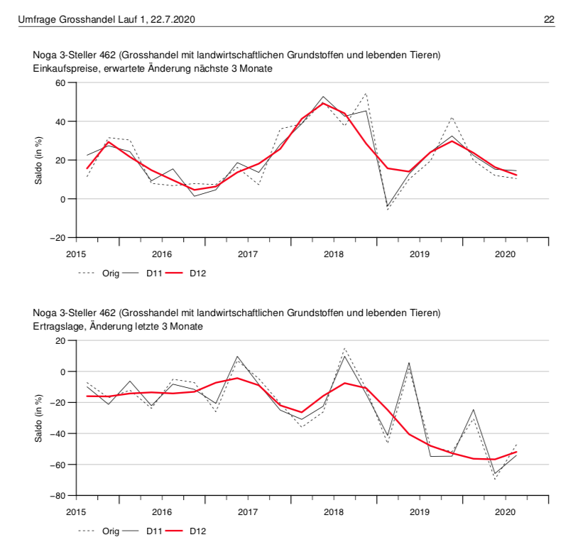
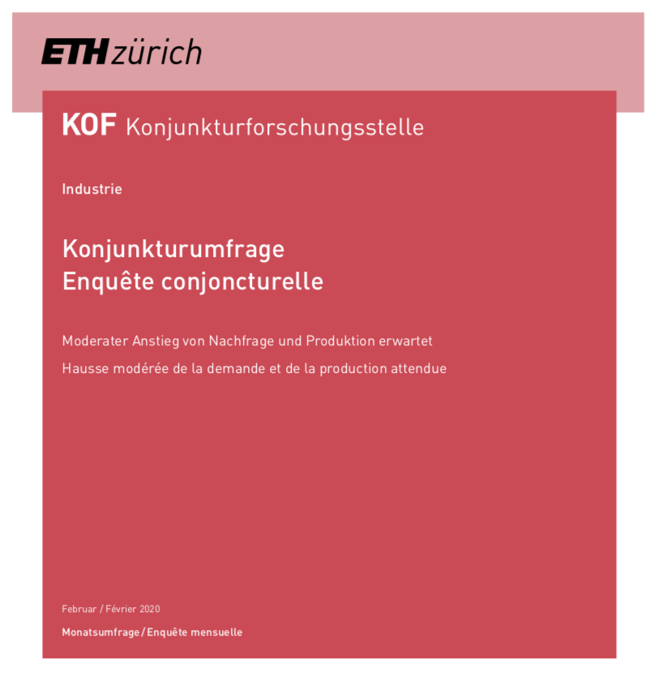
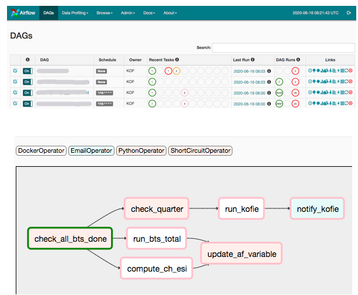
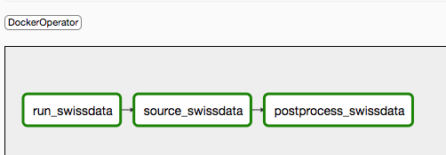

```{r setup, include=FALSE}
options(htmltools.dir.version = FALSE)
```


class: center, middle


## What is Production?


<div class="my-footer"><span><div class="footer-text" align="right">This presentation by Dr. Matthias Bannert is licensed under <a href="https://creativecommons.org/licenses/by-nc-sa/4.0/?ref=chooser-v1">CC BY-NC-SA 4.0</a></div></span></div> 


---


class: center, middle


<div class="my-footer"><span><div class="footer-text" align="right">This presentation by Dr. Matthias Bannert is licensed under <a href="https://creativecommons.org/licenses/by-nc-sa/4.0/?ref=chooser-v1">CC BY-NC-SA 4.0</a></div></span></div> 


---


class: center, middle


> Repeated (regular) runs of the same task resulting in a pre-defined,
quality controlled result. 
>
> `r tufte::quote_footer('--- KOF definition of production')`


<div class="my-footer"><span><div class="footer-text" align="right">This presentation by Dr. Matthias Bannert is licensed under <a href="https://creativecommons.org/licenses/by-nc-sa/4.0/?ref=chooser-v1">CC BY-NC-SA 4.0</a></div></span></div> 


---


class:center,middle

## KOF Output


<div class="my-footer"><span><div class="footer-text" align="right">This presentation by Dr. Matthias Bannert is licensed under <a href="https://creativecommons.org/licenses/by-nc-sa/4.0/?ref=chooser-v1">CC BY-NC-SA 4.0</a></div></span></div> 


---

class:center,middle





<div class="my-footer"><span><div class="footer-text" align="right">This presentation by Dr. Matthias Bannert is licensed under <a href="https://creativecommons.org/licenses/by-nc-sa/4.0/?ref=chooser-v1">CC BY-NC-SA 4.0</a></div></span></div> 


---


class:center, middle

## Docker
## Apache Airflow
## Gitlab CI


<div class="my-footer"><span><div class="footer-text" align="right">This presentation by Dr. Matthias Bannert is licensed under <a href="https://creativecommons.org/licenses/by-nc-sa/4.0/?ref=chooser-v1">CC BY-NC-SA 4.0</a></div></span></div> 


---

## Docker in One Slide


> Single purpose, application focused virtualization.

- **Images**: blueprints for **containers**.

- **Registries**: store images.

- **Docker files** are text based configs from which images are created.

- Images can be stacked, so we can build on existing images. 


<div class="my-footer"><span><div class="footer-text" align="right">This presentation by Dr. Matthias Bannert is licensed under <a href="https://creativecommons.org/licenses/by-nc-sa/4.0/?ref=chooser-v1">CC BY-NC-SA 4.0</a></div></span></div> 


---


## KOF Main Components: Docker Containers


.pull-left[
    
**permanent** containers: 
  
- PostgreSQL
- Apache Airflow
- miniCRAN
- custom docker registry
- APIs (plumber, servr, express.io)


**non-permanent** containers:

- a universal base image
- task specific images

]


<div class="my-footer"><span><div class="footer-text" align="right">This presentation by Dr. Matthias Bannert is licensed under <a href="https://creativecommons.org/licenses/by-nc-sa/4.0/?ref=chooser-v1">CC BY-NC-SA 4.0</a></div></span></div> 


---


## KOF Main Components: Gitlab CI

.pull-left[


on push to default branch

- build (R) packages 
- push to miniCRAN
- deploy to servers
- push files to docker host / volumes (rsync)
- (rebuild docker images)

]


<div class="my-footer"><span><div class="footer-text" align="right">This presentation by Dr. Matthias Bannert is licensed under <a href="https://creativecommons.org/licenses/by-nc-sa/4.0/?ref=chooser-v1">CC BY-NC-SA 4.0</a></div></span></div> 


---


## KOF Main Components: Gitlab CI


.pull-left[


on push to default branch

- build (R) packages 
- push to miniCRAN
- deploy to servers
- push files to docker host / volumes (rsync)
- (rebuild docker images)

]

.pull-right[

.gitlab-ci.yaml

```

[...]

stages:
  - buildncheck
  - kran
  - deploy

check:
  image: rocker/tidyverse:3.6.0
  stage: buildncheck
  artifacts:
    untracked: true
  script:
    # we don't need it and it causes a hidden file NOTE
    - rm .gitlab-ci.yml 
    - R -e 'devtools::install(".", repos = "miniCRAN")'
    - R -e 'devtools::check(error_on = "error")' 
    - R CMD build . --no-build-vignettes --no-manual

[...]

- ssh -t gitlabci@someserver.com 'sudo /usr/bin/R -e \\
  "install.packages(\"thatpack\", repos = \"miniCRAN\")"'


```

]


<div class="my-footer"><span><div class="footer-text" align="right">This presentation by Dr. Matthias Bannert is licensed under <a href="https://creativecommons.org/licenses/by-nc-sa/4.0/?ref=chooser-v1">CC BY-NC-SA 4.0</a></div></span></div> 


---


## KOF Main Components: Apache Airflow


.pull-left[


- SO questions tagged airflow: 4K+
- workflow scheduler
- monitor / overview dashboard
- can trigger processes locally, on VMs, docker, Kubernetes etc.


]

.pull-right[


```{r echo=FALSE, out.width=450}

```


]


<div class="my-footer"><span><div class="footer-text" align="right">This presentation by Dr. Matthias Bannert is licensed under <a href="https://creativecommons.org/licenses/by-nc-sa/4.0/?ref=chooser-v1">CC BY-NC-SA 4.0</a></div></span></div> 


---

class:center,middle

## Applied Examples


<div class="my-footer"><span><div class="footer-text" align="right">This presentation by Dr. Matthias Bannert is licensed under <a href="https://creativecommons.org/licenses/by-nc-sa/4.0/?ref=chooser-v1">CC BY-NC-SA 4.0</a></div></span></div> 


---


## An Example Workflow: Sourcing Data (ETL) 

</br>
</br>

.center[
> Gather data from various public sources, </br>
> transform into homogeneous time series format, </br>
> read into PostgreSQL database.</br>
> `r tufte::quote_footer('--- the swissdata project in a nutshell.')`

]


<div class="my-footer"><span><div class="footer-text" align="right">This presentation by Dr. Matthias Bannert is licensed under <a href="https://creativecommons.org/licenses/by-nc-sa/4.0/?ref=chooser-v1">CC BY-NC-SA 4.0</a></div></span></div> 


---

## Examples: The Swissdata Project


.pull-left[

### Directed Acyclic Graphs (DAG)


```{r echo=FALSE, out.width=450}

```

]

.pull-right[

```python

[...]

dag = DAG('swissdata', description='Run swissdata',
          schedule_interval = '0 9,17 * * *',
          default_args = default_args, catchup=False)

with dag:
    run_swissdata = DockerOperator(
        task_id = 'run_swissdata',
        image = 'some-docker-registry.ch/swissdata:0.1.0',
        api_version = 'auto',
        auto_remove = True,
        force_pull = True,
        volumes = [
            'swissdata-output:/output'
        ],
        docker_url = "unix:///var/run/docker.sock"
    )

    source_swissdata = DockerOperator(
        task_id = 'source_swissdata',
        image = 'some-docker-registry.ch/kofbase:0.1.0',
        user='some-base-user',
        api_version = 'auto',
        auto_remove = True,
        force_pull = True,
        volumes = [
            'swissdata-output:/swissdata',
            'kofbase-tasks:/tasks'
        ],
        docker_url = 'unix:///var/run/docker.sock',
        environment = {
            'PG_PASSWORD': pg_password
        },
        command = 'source_swissdata' 
    )

    postprocess_swissdata = DockerOperator(

    ...

    )

run_swissdata.set_downstream(source_swissdata)
source_swissdata.set_downstream(postprocess_swissdata)


```


]


<div class="my-footer"><span><div class="footer-text" align="right">This presentation by Dr. Matthias Bannert is licensed under <a href="https://creativecommons.org/licenses/by-nc-sa/4.0/?ref=chooser-v1">CC BY-NC-SA 4.0</a></div></span></div> 


---


## Task Specific Image


.py-large[
```python

run_swissdata = DockerOperator(
        task_id = 'run_swissdata',
        image = 'some-docker-registry.ch/swissdata:0.1.0',
        api_version = 'auto',
        auto_remove = True,
        force_pull = True,
        volumes = [
            'swissdata-output:/output'
        ],
        docker_url = "unix:///var/run/docker.sock"
    )

```

]


<div class="my-footer"><span><div class="footer-text" align="right">This presentation by Dr. Matthias Bannert is licensed under <a href="https://creativecommons.org/licenses/by-nc-sa/4.0/?ref=chooser-v1">CC BY-NC-SA 4.0</a></div></span></div> 


---


## Standard Image and a Task File


.py-large[

```python

source_swissdata = DockerOperator(
        task_id = 'source_swissdata',
        image = 'some-docker-registry.ch/kofbase:0.1.0',
        user='some-base-user',
        api_version = 'auto',
        auto_remove = True,
        force_pull = True,
        volumes = [
            'swissdata-output:/swissdata',
            'kofbase-tasks:/tasks'
        ],
        docker_url = 'unix:///var/run/docker.sock',
        environment = {
            'PG_PASSWORD': pg_password
        },
        command = 'source_swissdata' 
    )
```

]


<div class="my-footer"><span><div class="footer-text" align="right">This presentation by Dr. Matthias Bannert is licensed under <a href="https://creativecommons.org/licenses/by-nc-sa/4.0/?ref=chooser-v1">CC BY-NC-SA 4.0</a></div></span></div> 


---


## The Role of R 

.pull-left[

### What Does R Do in This?

- miniCRAN + R packages take care of dependencies
- Downloading, reading and processing data using packages such as
_{readxl}_, _{httr}_, _{rvest}_, _{xml2}_, _{jsonlite}_,
_{pxR}_, _{tsbox}_, _{yaml}_, ... 
- R is used as database interface layer _{timeseriesdb}_


]


<div class="my-footer"><span><div class="footer-text" align="right">This presentation by Dr. Matthias Bannert is licensed under <a href="https://creativecommons.org/licenses/by-nc-sa/4.0/?ref=chooser-v1">CC BY-NC-SA 4.0</a></div></span></div> 


---

## The Role of R 

.pull-left[

### What Does R Do in This?

- miniCRAN + R packages take care of dependencies
- Downloading, reading and processing data using packages such as
_{readxl}_, _{httr}_, _{rvest}_, _{xml2}_, _{jsonlite}_,
_{pxR}_, _{tsbox}_, _{yaml}_, ... 
- R is used as database interface layer _{timeseriesdb}_


]

.pull-right[

### Is R any Good at This?


]


<div class="my-footer"><span><div class="footer-text" align="right">This presentation by Dr. Matthias Bannert is licensed under <a href="https://creativecommons.org/licenses/by-nc-sa/4.0/?ref=chooser-v1">CC BY-NC-SA 4.0</a></div></span></div> 


---

## The Role of R 

.pull-left[

### What Does R Do in This?

- miniCRAN + R packages take care of dependencies
- Downloading, reading and processing data using packages such as
_{readxl}_, _{httr}_, _{rvest}_, _{xml2}_, _{jsonlite}_,
_{pxR}_, _{tsbox}_, _{yaml}_, ... 
- R is used as database interface layer _{timeseriesdb}_


]

.pull-right[

### Is R any Good at This?

- dependencies are managed reasonably well, 
weaknesses are mitigated by docker


]


<div class="my-footer"><span><div class="footer-text" align="right">This presentation by Dr. Matthias Bannert is licensed under <a href="https://creativecommons.org/licenses/by-nc-sa/4.0/?ref=chooser-v1">CC BY-NC-SA 4.0</a></div></span></div> 


---

## The Role of R 

.pull-left[

### What Does R Do in This?

- miniCRAN + R packages take care of dependencies
- Downloading, reading and processing data using packages such as
_{readxl}_, _{httr}_, _{rvest}_, _{xml2}_, _{jsonlite}_,
_{pxR}_, _{tsbox}_, _{yaml}_, ... 
- R is used as database interface layer _{timeseriesdb}_


]

.pull-right[

### Is R any Good at This?

- dependencies are managed reasonably well, 
weaknesses are mitigated by docker

- R interfaces incredibly well, there is an 
R package for everything (15K+ and counting). 


]


<div class="my-footer"><span><div class="footer-text" align="right">This presentation by Dr. Matthias Bannert is licensed under <a href="https://creativecommons.org/licenses/by-nc-sa/4.0/?ref=chooser-v1">CC BY-NC-SA 4.0</a></div></span></div> 


---

## The Role of R 

.pull-left[

### What Does R Do in This?

- miniCRAN + R packages take care of dependencies
- Downloading, reading and processing data using packages such as
_{readxl}_, _{httr}_, _{rvest}_, _{xml2}_, _{jsonlite}_,
_{pxR}_, _{tsbox}_, _{yaml}_, ... 
- R is used as database interface layer _{timeseriesdb}_


]

.pull-right[

### Is R any Good at This?

- dependencies are managed reasonably well, 
weaknesses are mitigated by docker

- R interfaces incredibly well, there is an 
R package for everything (15K+ and counting). 

- R is inclusive: it's interpreted. It runs on any major OS. Amazing resources 
to reach carpentry level. It's free. 

]


<div class="my-footer"><span><div class="footer-text" align="right">This presentation by Dr. Matthias Bannert is licensed under <a href="https://creativecommons.org/licenses/by-nc-sa/4.0/?ref=chooser-v1">CC BY-NC-SA 4.0</a></div></span></div> 


---

class: thanks

## Resources

- [Rocker Project](https://www.rocker-project.org/)
- [Apache Airflow](https://airflow.apache.org/) 
- [miniCRAN](https://cran.r-project.org/web/packages/miniCRAN/index.html)
- [gitlab CI](https://docs.gitlab.com/ee/ci/)


<div class="my-footer"><span><div class="footer-text" align="right">This presentation by Dr. Matthias Bannert is licensed under <a href="https://creativecommons.org/licenses/by-nc-sa/4.0/?ref=chooser-v1">CC BY-NC-SA 4.0</a></div></span></div> 


---

class:center,middle

## Stay in Touch! 


### @whatsgoodio: [https://twitter.com/whatsgoodio](https://twitter.com/whatsgoodio)

### Email: bannert [at] kof.ethz.ch

### see you @user2021global (July 2021)


<div class="my-footer"><span><div class="footer-text" align="right">This presentation by Dr. Matthias Bannert is licensed under <a href="https://creativecommons.org/licenses/by-nc-sa/4.0/?ref=chooser-v1">CC BY-NC-SA 4.0</a></div></span></div> 


